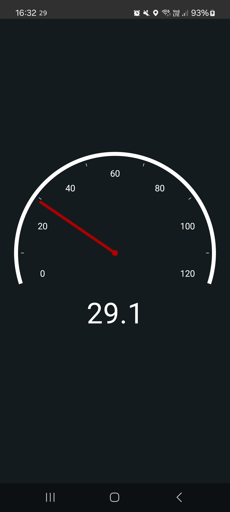

# Status Bar Speedometer
A simple Android app that displays your current speed as a notification in the status bar.

Great for outdoor activities and playing AR games.

Get it on the [Play Store](https://play.google.com/store/apps/details?id=ch.rmy.android.statusbar_tacho), on [F-Droid](https://f-droid.org/en/packages/ch.rmy.android.statusbar_tacho/) or [download the latest APK](https://github.com/Waboodoo/Status-Bar-Tachometer/releases) directly.

## Features
- Uses GPS to determine your current speed and displays it as a notification in the unit of your choice: **m/s**, **km/h**, **mi/h**, **ft/s**
- Dark Mode support
- Can be toggled through a home screen widget or through quick settings tile
- Will automatically restart when device reboots
- Translated into English, French, German, Polish, Russian, Brazilian Portuguese and Turkish

